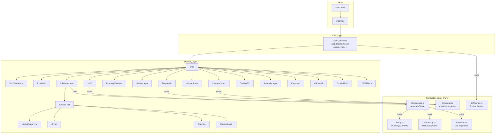
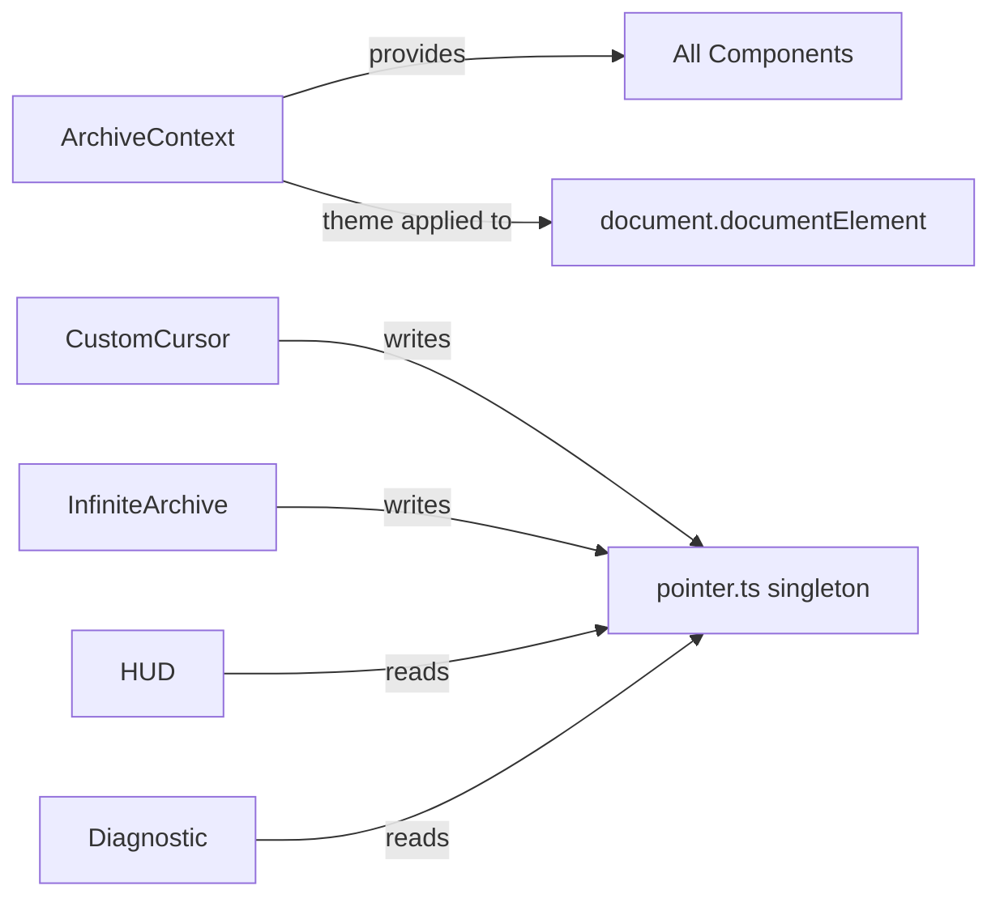

# Architecture

## High-Level Architecture

VESSEL is a **single-context React SPA** with no backend, no routing, and no code splitting. The entire application lives in one render tree rooted at `ArchiveProvider` → `Shell`. All state is centralized in a single React Context. All generation logic is pure and deterministic.



## Layer Responsibilities

### 1. Entry Layer

**`index.html`** — Beyond the standard `<div id="root">`, this file embeds three Arena platform scripts (session recording via rrweb, page-view analytics, and an element picker for WYSIWYG editing). These scripts are injected by the Arena development environment and are not part of the VESSEL application logic. They communicate with the parent iframe via `postMessage`.

**`main.tsx`** — Mounts `<App />` inside `<StrictMode>` onto `#root`. No router, no error boundary, no lazy loading.

### 2. State Layer — `ArchiveContext.tsx`

The single source of truth. A React Context provider that owns:

| State | Type | Default | Description |
|---|---|---|---|
| `seed` | `string` | `hexSeed(8)` | 8-char hex, drives all generation |
| `themeId` | `ThemeId` | `'vessel'` | Current color theme index |
| `theme` | `Theme` | derived | Resolved theme object |
| `frozen` | `boolean` | `false` | When true, all CSS animations pause and canvas rendering halts |
| `diagnostic` | `boolean` | `false` | Toggles diagnostic grid overlay and debug labels |
| `booted` | `boolean` | `false` | Boot sequence completed |
| `room` | `RoomId \| null` | `null` | Currently open hidden room overlay |
| `reduced` | `boolean` | `prefersReduced()` | `prefers-reduced-motion` media query result (read once, never updated) |
| `spawns` | `SpawnEvent[]` | `[]` | Active spawn effects (capped at 36, FIFO) |
| `log` | `string[]` | 2 entries | System log lines (capped at 48, FIFO) |

Actions exposed via context: `mutateTheme`, `regenerate`, `toggleFreeze`, `toggleDiagnostic`, `setBooted`, `openRoom`, `closeOverlays`, `spawnAt`, `pushLog`.

**State ownership rule**: All mutable state lives in `ArchiveContext`. Components are consumers, not owners. The only exceptions are:
- `lib/pointer.ts` — a module-level mutable singleton for pointer/scroll position (performance optimization to avoid re-renders)
- `FloatingWindows` local state for drag positions and close state
- `InfiniteArchive` local state for visible cluster range and height cache

### 3. Generation Layer — `lib/`

All generation functions are **pure**: given the same seed and index inputs, they produce identical output. No side effects, no DOM access, no randomness outside the seeded PRNG.

**`rng.ts`** — The foundation. Implements:
- `hashString(str)` → `number` — FNV-1a-variant string hash
- `mulberry32(seed)` → `RNG` — 32-bit PRNG returning `[0, 1)`
- `rngFrom(seed, ...salt)` → `RNG` — Creates a derived RNG by mixing seed + salts with golden-ratio hashing
- Helpers: `pick`, `pickN`, `range`, `irange`, `chance`, `hexSeed`, `padHex`

**`catalog.ts`** — The image catalog. 60 entries split into:
- 22 generated images (`g-*` prefix, `/images/gen/`) — AI-generated occult/surreal imagery
- 38 stock images (`s-*` prefix, `/images/stock/`) — real photographs

Each entry has: `id`, `src`, `alt`, `kind` (16 categories), `ratio` (aspect ratio), optional `rare`, `normal`, `room` flags.

Pre-computed indexes: `BY_KIND`, `RARES`, `NORMALS`, `ROOMS`.

**`generate.ts`** — The cluster generation engine. `generateCluster(seed, index)` produces a `ClusterSpec` containing:
- Layout choice (10 layouts, first cluster always `'oriel'`)
- 7–14 image nodes, each with position, size, rotation, z-index, behavior, treatment, caption, label, and optional anomaly
- 3–8 glyphs (SVG sigils)
- 1–3 warning labels
- 1–3 diagrams
- Title and accession number

**`lexicon.ts`** — All text content:
- 35 `FRAGMENTS` (longer ominous phrases)
- 28 `SHORT` words (single words used in labels/captions)
- 15 `WARNINGS` (label text)
- 10 `ACCESSION` prefixes
- 9 `WINDOW_TITLES`
- 15 `LOG_LINES`
- 7 `ROOM_COPY` entries (title, subtitle, body paragraphs)
- `accessionOf(n)` function for generating accession strings

**`themes.ts`** — 7 color themes, each defining 10 CSS custom properties: `bg`, `fg`, `accent`, `accent2`, `warn`, `paper`, `metal`, `void`, `scan`, `glow`. Applied to `document.documentElement` via inline styles.

**`pointer.ts`** — Module-level mutable singleton holding `{ x, y, vx, vy }` (pointer) and `{ y }` (scroll). Written by `CustomCursor` and `InfiniteArchive`, read by `HUD` and `Diagnostic`. This avoids React re-renders for high-frequency pointer data.

**`types.ts`** — All TypeScript interfaces and union types used across the application.

### 4. Render Layer — Components

Components are organized by function:

**Lifecycle components:**
- `BootSequence` — Animated terminal boot, gates the rest of the interface
- `Keyboard` — Global keydown listener, renders nothing
- `ClickVoid` — Global click listener for spawn effects, renders nothing

**Content components:**
- `IntroRelic` — Hero section with room navigation buttons
- `InfiniteArchive` — Scroll-driven virtualizer for clusters
- `Cluster` — Single cluster section with parallax
- `LivingImage` — Individual image with treatment, behavior, and interaction
- `Glyph` — SVG sigil (8 variants)
- `Diagram` — SVG technical diagram (6 variants: Vesica, Orbitals, Lattice, AnatomyMap, StarChart, CircuitSeal)
- `WarningLabel` — Styled warning text

**Overlay components:**
- `HiddenRoom` — Framer Motion modal for room detail views
- `FloatingWindows` — Draggable Win95-style windows
- `Diagnostic` — Debug grid overlay
- `SpawnLayer` — Spawn effect renderer

**Decorative components:**
- `OverlayFX` — CRT scanlines, noise, vignette, video grain (canvas + CSS)
- `CustomCursor` — Canvas-rendered cursor with particle trail
- `AnomalyLayer` — Fixed-position anomaly images (moon, eye, skeleton)
- `SymbolRail` — Fixed sidebar navigation for rooms
- `SVGFilters` — SVG filter definitions (melt, RGB split, velocity distortion, grain, glow)

**System components:**
- `HUD` — Fixed heads-up display with seed, theme, coordinates, and action buttons

## Component Communication Pattern



Components communicate exclusively through `ArchiveContext`. The one exception is `lib/pointer.ts`, which acts as a shared mutable bus for high-frequency pointer/scroll data that would be wasteful to route through React state.

## CSS Architecture

All styling is in `src/index.css` (313 lines). The CSS architecture is:

1. **CSS custom properties** — 10 theme variables set on `:root` by `applyTheme()`
2. **Tailwind utilities** — imported via `@import "tailwindcss"` and used inline on JSX
3. **Animation keyframes** — 10 named animations (melt, rgbSplit, pulseSoft, orbit, burn, spin, floaty, blink, swarm, ripple, sigilIn)
4. **CSS masks** — 6 mask shapes applied via class names to image containers
5. **Visual effect layers** — scanlines, noise overlay, vignette, CRT curve
6. **Component styles** — bezel (image borders), win95 (floating windows), warn-stripe (warning labels), paper-stain (hidden room backgrounds), diag-grid (diagnostic overlay)

The CSS uses `!important` sparingly: only for the `.frozen *` animation-pause rule and the `@media (prefers-reduced-motion: reduce)` overrides.

## Build System

```mermaid
graph LR
    SRC[src/*.tsx, *.ts, *.css] --> VITE[Vite 7.3]
    VITE --> REACT[@vitejs/plugin-react<br/>Babel transform]
    VITE --> TAILWIND[@tailwindcss/vite<br/>CSS processing]
    VITE --> TAGS[.vite-source-tags.js<br/>data-source-loc injection]
    VITE --> DIST[dist/]
```

- **Vite 7.3** with React plugin (Babel) and Tailwind v4 plugin
- **Source tags plugin** — a custom Babel transform that adds `data-source-loc="file:line:col"` to every JSX element at compile time, enabling the Arena element picker
- **TypeScript** — strict mode, no emit (type checking only)
- **No code splitting** — entire app bundles into one JS chunk (~388 KB / ~123 KB gzip)
- **Environment variables** — supports `VITE_*` and `NEXT_PUBLIC_*` prefixes via Vite's `envPrefix` and `define`

## Platform Integration

The `index.html` embeds three Arena platform scripts that are **not part of VESSEL's functionality**:

1. **Session recording** (`data-arena-recording`) — Captures DOM mutations via rrweb, mouse/keyboard/scroll interactions, and cursor path. Stores in sessionStorage, reports to parent iframe on `arena:flush`.

2. **Page views** (`data-arena-views`) — POSTs a page-view event to `https://www.designarena.ai/api/agon/page-views`.

3. **Element picker** (`data-element-picker`) — A full WYSIWYG inspector/editor that enables click-to-select (for AI chat prefill) and inline text editing (contenteditable) via `postMessage` commands from the parent frame.

These scripts are injected by the Arena development platform and will not be present in a standalone deployment.
