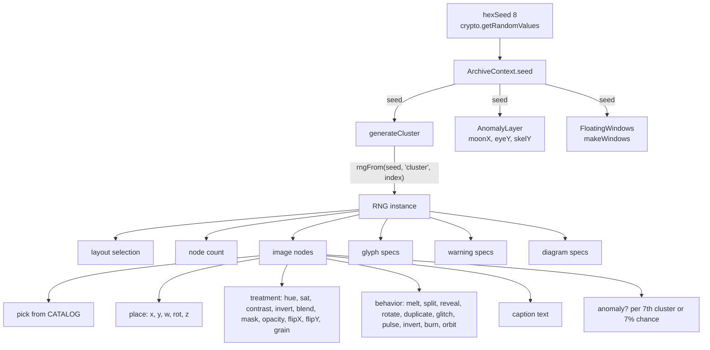
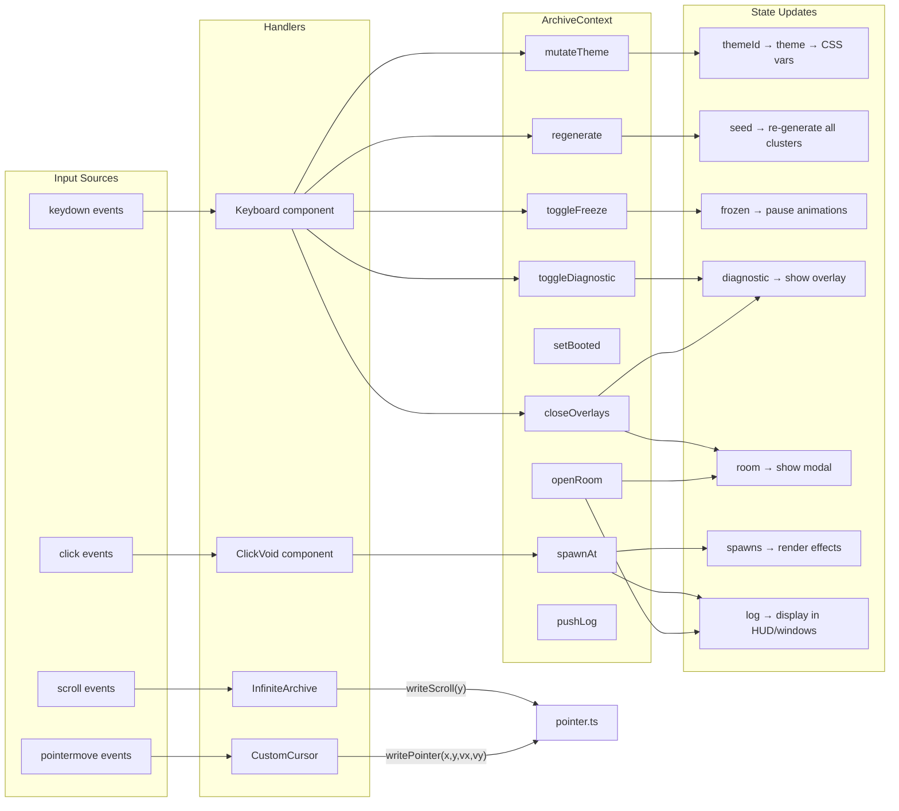
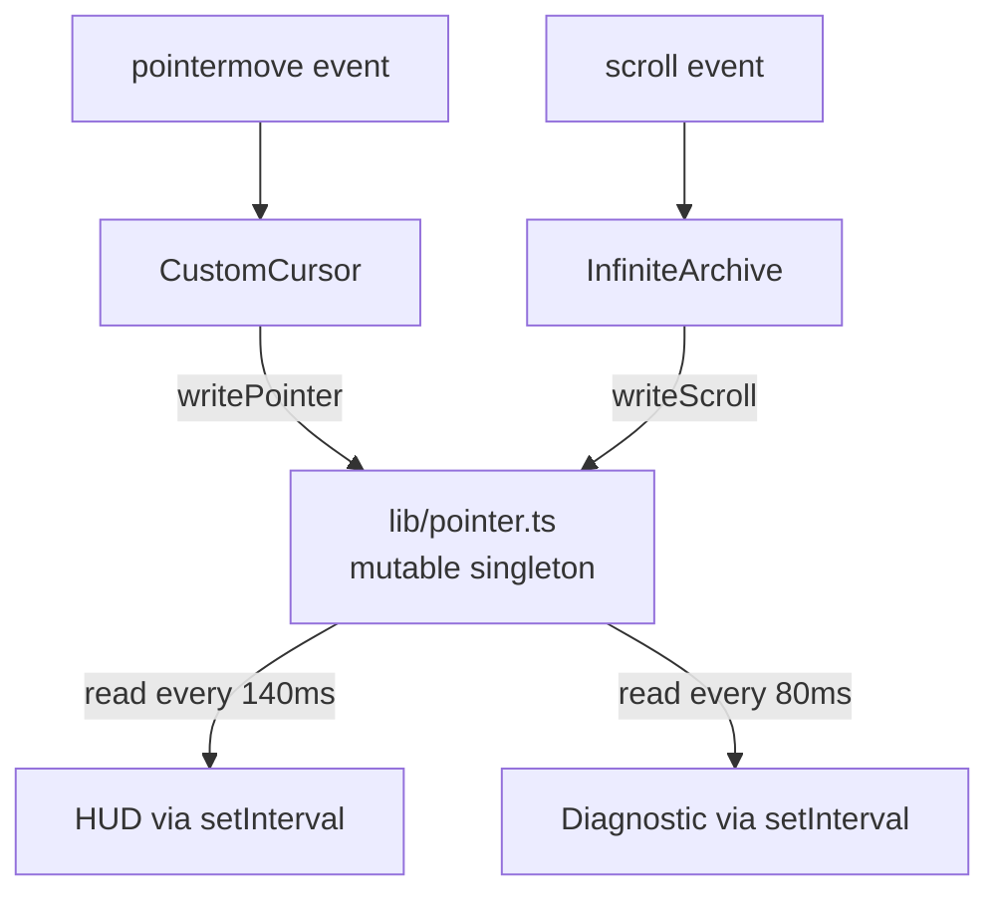
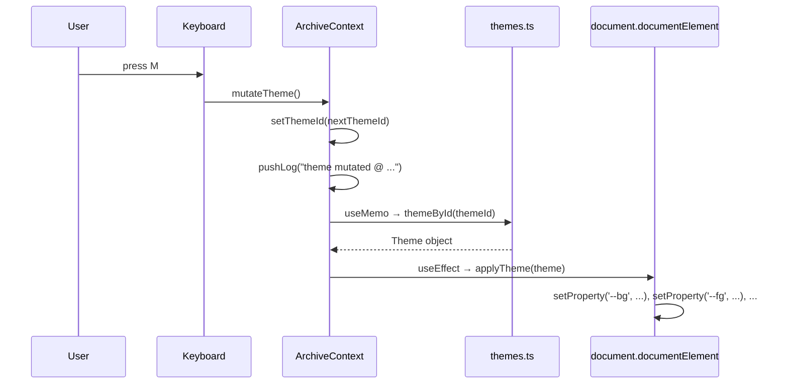
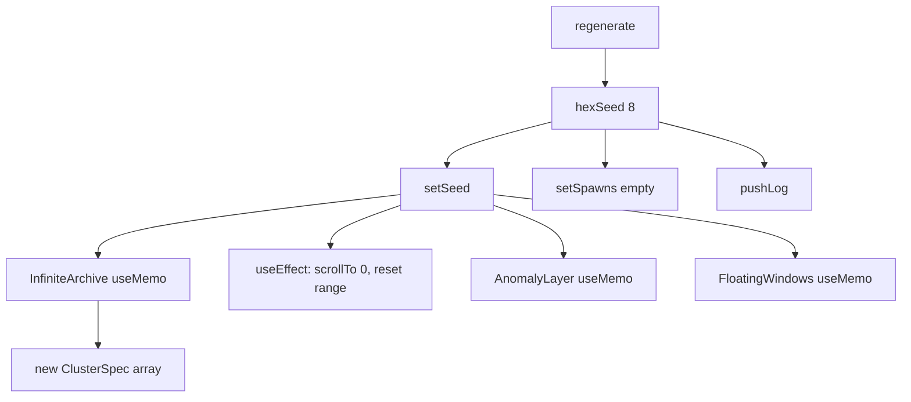

# Data Flow

## Overview

VESSEL has three distinct data flows:

1. **Deterministic generation flow** — seed → PRNG → cluster specs → rendered DOM
2. **User interaction flow** — input events → ArchiveContext → state updates → re-renders
3. **Pointer telemetry flow** — pointer/scroll → module singleton → polling consumers

## Deterministic Generation Flow



### Step-by-step

1. `hexSeed(8)` generates 8 random hex characters via `crypto.getRandomValues`
2. `ArchiveContext` stores this as `seed`
3. `InfiniteArchive` calls `generateCluster(seed, index)` for each visible cluster
4. Inside `generateCluster`:
   - `rngFrom(seed, 'cluster', index)` creates a deterministic RNG
   - Layout is picked from 10 options (cluster 0 always gets `'oriel'`)
   - Node count: 5–8 for oriel, 7–14 for others
   - For each node:
     - Image picked from `CATALOG` (60 items) with rare/normal bias
     - Position calculated by layout algorithm (`place()`)
     - Visual treatment generated (`treatment()`)
     - Behavior assigned randomly from 10 options
     - Caption composed from `FRAGMENTS` or `SHORT` word pairs
     - Anomaly assigned every 7th cluster (deterministic) or 7% random chance
5. Generated `ClusterSpec` is immutable once created

**Critical invariant**: The same `(seed, index)` pair always produces the identical `ClusterSpec`. This is guaranteed by the mulberry32 PRNG, which is a pure function of its seed.

### Cluster Spec Shape

```
ClusterSpec {
  index: number            // cluster index in the infinite sequence
  layout: ClusterLayout    // one of 10 layout strategies
  height: number           // section height in px (920–1280)
  nodes: ImageNode[]       // 5–14 image placements
  glyphs: GlyphSpec[]      // 3–8 SVG sigils
  warnings: WarningSpec[]  // 1–3 warning labels
  diagrams: DiagramSpec[]  // 1–3 technical diagrams
  title: string            // two-word title from SHORT
  accession: string        // e.g. "ACC-4713.07"
}
```

## User Interaction Flow



### Interaction → State → Render mapping

| User Action | Context Method | State Changed | Components Re-rendered |
|---|---|---|---|
| Press M | `mutateTheme()` | `themeId` | All (theme CSS vars change) |
| Press R | `regenerate()` | `seed`, `spawns` | All (regeneration triggers full re-render) |
| Press S | `toggleFreeze()` | `frozen` | OverlayFX, CustomCursor, LivingImage (animation pause) |
| Press D | `toggleDiagnostic()` | `diagnostic` | Cluster (debug labels), Diagnostic overlay, FloatingWindows (diag window) |
| Press ESC | `closeOverlays()` | `room`, `diagnostic` | HiddenRoom, Diagnostic, FloatingWindows |
| Click void | `spawnAt(x,y)` | `spawns`, `log` | SpawnLayer, HUD (log display) |
| Click anomaly | `openRoom(id)` | `room`, `log` | HiddenRoom, HUD |
| Scroll | — | `pointer.ts` (not state) | None directly; triggers cluster range update |

## Pointer Telemetry Flow



This is the **only data flow that bypasses React state**. It exists for performance: pointer updates happen at 60fps and routing them through `useState` would cause unnecessary re-renders of all context consumers.

The `pointer.ts` module exposes:
- `pointer: { x, y, vx, vy }` — cursor position and velocity
- `scroll: { y }` — scroll offset
- `writePointer(x, y, vx, vy)` — called by `CustomCursor` on every animation frame
- `writeScroll(y)` — called by `InfiniteArchive` on every scroll event

Consumers (`HUD`, `Diagnostic`) poll these values via `setInterval`.

## Theme Application Flow



Theme application is **imperative**: it sets CSS custom properties directly on `document.documentElement.style`. This means:
- All Tailwind classes using `var(--fg)`, `var(--accent)`, etc. update immediately
- No React re-renders are needed for theme-agnostic components
- SVG filter colors in `Glyph`, `Diagram` use `theme.accent` / `theme.accent2` directly, so those components do re-render

## Seed Change Cascade



A seed change is a **full regeneration**: every cluster, anomaly position, floating window position, and glyph placement recomputes from scratch. The scroll position resets to top.
