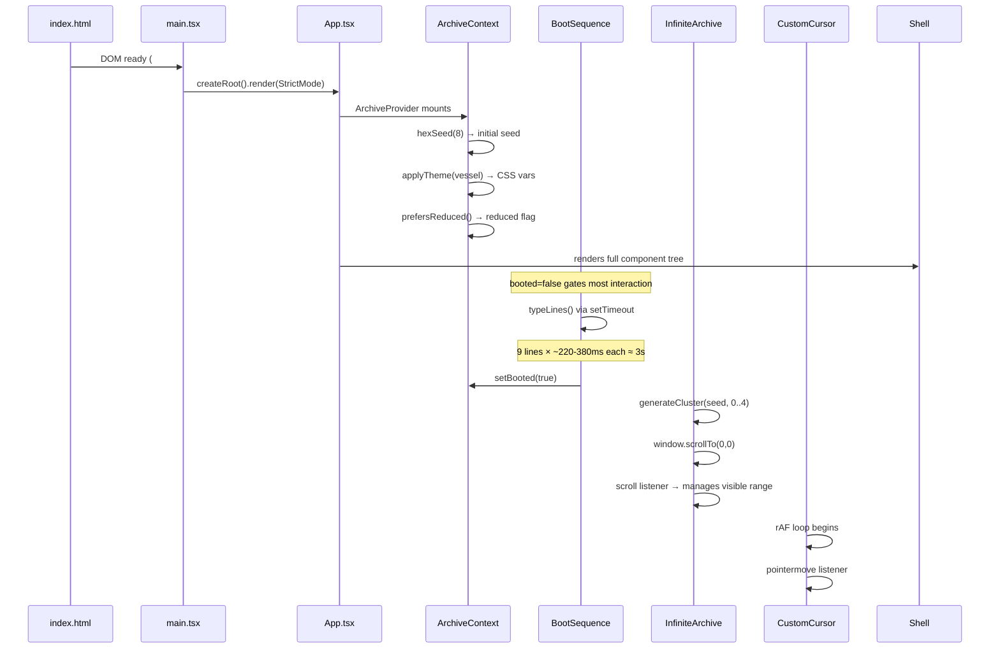

# Execution Model

## Startup Sequence



### Phase 1: Bootstrap

1. Browser parses `index.html`, loads Google Fonts (preconnect hints), Arena platform scripts
2. `main.tsx` mounts `<App />` inside `<StrictMode>` — React may double-invoke effects in development
3. `App` renders `<ArchiveProvider>` → `<Shell>`
4. `ArchiveProvider` initializes:
   - `seed = hexSeed(8)` — uses `crypto.getRandomValues` for 8 random hex characters
   - `themeId = 'vessel'` — hardcoded default
   - `frozen = false`, `diagnostic = false`, `booted = false`, `room = null`
   - `reduced = prefersReduced()` — checked once at mount, **never re-evaluated** (if the user changes their OS preference mid-session, the app will not respond)
   - `spawns = []`, `log = ['> VESSEL OS 0.9.4 — disc mounted', '> waiting for observer']`
5. `useEffect` in `ArchiveProvider` calls `applyTheme(theme)` → sets 10 CSS custom properties on `document.documentElement`

### Phase 2: Boot Animation

`BootSequence` renders a full-screen overlay while `booted === false`. It reveals 9 lines one at a time via `setTimeout` with staggered delays (220ms + (n%3)*80ms). After the last line, a 500ms delay fires `setBooted(true)`.

The "skip rite" button calls `setBooted(true)` immediately.

**Invariant**: While `booted === false`, the `ClickVoid` component does not attach its click listener, so no spawn effects fire during boot.

### Phase 3: Main Interface

Once `booted === true`:

1. `BootSequence` returns `null` (unmounts)
2. `IntroRelic` renders the hero section (always present, not gated by boot)
3. `InfiniteArchive` runs:
   - `useMemo` generates 5 cluster specs from `generateCluster(seed, 0..4)`
   - Scroll listener attached via `useEffect` with `requestAnimationFrame` throttling
   - Visible range starts at `{ lo: 0, hi: 4 }`
4. `OverlayFX` starts:
   - Canvas noise generation via `requestAnimationFrame` (skips every 3rd frame)
   - Video grain `<video>` element autoplays (if asset exists)
5. `CustomCursor` starts:
   - `requestAnimationFrame` loop for particle rendering
   - `pointermove` listener for position tracking
   - Writes to `lib/pointer.ts` singleton on each frame

### Phase 4: Interaction

All user interaction flows through `ArchiveContext`:

| Input | Handler | Effect |
|---|---|---|
| `keydown: M` | `Keyboard` → `mutateTheme()` | Cycles to next theme, applies CSS vars, pushes to log |
| `keydown: R` | `Keyboard` → `regenerate()` | New `hexSeed(8)`, clears spawns, pushes to log |
| `keydown: S` | `Keyboard` → `toggleFreeze()` | Toggles `frozen`, pauses all animations |
| `keydown: D` | `Keyboard` → `toggleDiagnostic()` | Toggles diagnostic grid and debug labels |
| `keydown: ESC` | `Keyboard` → `closeOverlays()` | Clears `room` and `diagnostic` |
| `click` on void | `ClickVoid` → `spawnAt()` | Creates random `SpawnEvent`, pushes to log |
| `click` on anomaly image | `LivingImage` → `openRoom()` | Opens hidden room overlay |
| `click` on intro buttons | `IntroRelic` → `openRoom()` | Opens hidden room overlay |
| `click` on SymbolRail buttons | `SymbolRail` → `openRoom()` | Opens hidden room overlay |
| `scroll` | `InfiniteArchive` | Adjusts visible cluster range, writes scroll to `pointer.ts` |

## Scroll-Driven Virtualization

`InfiniteArchive` implements a simple virtualization pattern:

1. Maintains a visible range `{ lo, hi }` of cluster indices
2. On scroll, determines which cluster the viewport center overlaps
3. Sets `lo = max(0, current - 2)` and `hi = current + 4`
4. Generates cluster specs for the visible range via `generateCluster`
5. Pads above with accumulated heights of off-screen clusters
6. Uses a fixed 2400px post-padding to allow continued scrolling

**Height estimation**: Each cluster's height is stored in a `Map<number, number>` ref. If a cluster hasn't been measured yet, it defaults to 1100px.

**Key assumption**: Cluster heights are deterministic from the seed+index (they are: `generateCluster` produces `height: range(rand, 920, 1280)`). The height cache is never cleared on seed change — it is reset by the `useEffect` that calls `setRange({ lo: 0, hi: 4 })` and `window.scrollTo(0, 0)` when the seed changes.

## Animation and Timing

### CSS Animations

10 named CSS animations, all defined in `index.css`:

| Name | Duration | Style | Applies To |
|---|---|---|---|
| `melt` | 7s | ease-in-out infinite | Images with `behavior: 'melt'` |
| `rgbSplit` | 2.8s | steps(2) infinite | Images with `behavior: 'glitch'` |
| `pulseSoft` | 4.4s | ease-in-out infinite | Images with `behavior: 'pulse'`, eye anomaly |
| `orbit` | 14s | linear infinite | Images with `behavior: 'orbit'` |
| `burn` | 1.8s | steps(3) infinite | Images with `behavior: 'burn'` |
| `spin` | 48s | linear infinite | Images with `behavior: 'rotate'`, moon anomaly |
| `floaty` | 9s | ease-in-out infinite | Skeleton anomaly |
| `blink` | 1.1s | step-end infinite | Caret character |
| `swarm` | 1.5s | ease-out forwards | Swarm spawn effects |
| `ripple` | 1.6s | ease-out forwards | Ripple spawn effects |
| `sigilIn` | 1.8–2.1s | ease-out forwards | Sigil/text spawn effects |
| `noiseShift` | 0.8s | steps(4) infinite | Noise overlay |

**Freeze mechanism**: The `.frozen *` CSS selector uses `animation-play-state: paused !important` to stop all animations. The `OverlayFX` canvas also checks the `frozen` flag to skip rendering.

### Canvas Animation Loops

Three components use `requestAnimationFrame`:

1. **`CustomCursor`** — Renders particle trail, updates ring and HUD positions. Checks `frozen` flag to skip.
2. **`OverlayFX`** — Generates noise texture on a 180×120 canvas. Checks `frozen` and skips 2/3 frames. Disabled entirely when `reduced` is true.
3. **`Diagnostic`** — Updates pointer/scroll display every 80ms via `setInterval` (not rAF).

### Parallax

`Cluster` applies scroll-based parallax to elements with `data-para` attributes. The parallax depth is `0.35 + (z % 7) * 0.08`, meaning z-index contributes a small depth variation. The parallax uses `--para` CSS variable, set via `style.setProperty` on each `requestAnimationFrame` callback during scroll.

## Teardown and Cleanup

Every `useEffect` in the codebase returns a cleanup function that removes event listeners and cancels animation frames. The pattern is consistent:

```typescript
useEffect(() => {
  // setup
  return () => {
    // cleanup: removeEventListener, cancelAnimationFrame, clearTimeout
  };
}, [deps]);
```

**No memory leaks observed in current code.** However:
- The `OverlayFX` video element has no explicit cleanup (it relies on React's DOM cleanup on unmount)
- The `CustomCursor` particle array grows unbounded until cleanup (capped at 42 items via splice)

## Reduced Motion

When `prefers-reduced-motion: reduce` is active:
- `reduced` flag is set in `ArchiveContext` (checked once at mount)
- `OverlayFX` skips canvas rendering entirely
- `OverlayFX` video grain layer is not rendered
- `AnomalyLayer` returns `null`
- `CustomCursor` suppresses particle trail generation (but still renders the cursor ring)
- CSS overrides in `@media (prefers-reduced-motion: reduce)` disable all named animations

**Gap**: `reduced` is only checked once at mount. If the user toggles their OS setting mid-session, the app will not respond without a page reload.
