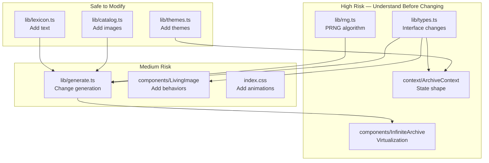

# Extension Guide

## Adding a New Image to the Catalog

1. Place the image file in `public/images/gen/` (for generated) or `public/images/stock/` (for stock photos)

2. Add an entry to `CATALOG` in `src/lib/catalog.ts`:

```typescript
{
  id: 'g-new',                              // Unique, prefix with 'g-' or 's-'
  src: '/images/gen/new-image.png',         // Path under public/
  alt: 'Description of the image',          // Used for caption and accessibility
  kind: 'anatomy',                          // One of 16 ImageKind values
  ratio: 1.33,                              // width / height aspect ratio
  rare: true,                               // Optional: preferential selection
  room: 'eye',                              // Optional: associated hidden room
}
```

3. The image will automatically appear in cluster generation. No other files need to change.

**Invariants to maintain**:
- `id` must be unique across the catalog
- `kind` must be a valid `ImageKind`
- `ratio` must be positive
- `src` must start with `/images/`

## Adding a New Behavior

1. Add the behavior name to the `Behavior` type in `src/lib/types.ts`:
```typescript
export type Behavior = ... | 'newbehavior';
```

2. Add it to the `BEHAVIORS` array in `src/lib/generate.ts`:
```typescript
const BEHAVIORS: Behavior[] = [..., 'newbehavior'];
```

3. Implement the visual in `src/components/LivingImage.tsx`:
   - Add a CSS class mapping in `BEHAVE` if it's a class-based animation
   - Add custom JSX if it needs structural changes (like `split` or `duplicate`)
   - Add hover behavior in the event handlers if needed

4. Add the corresponding CSS animation in `src/index.css`:
```css
.newbehavior {
  animation: newAnim 4s ease-in-out infinite;
}
@keyframes newAnim {
  /* ... */
}
```

5. If using an SVG filter, add it to `SVGFilters.tsx`.

**Testing**: Since there are no automated tests, verify by running the dev server and pressing `R` several times to regenerate until the new behavior appears.

## Adding a New Hidden Room

1. Add the room ID to `RoomId` in `src/lib/types.ts`:
```typescript
export type RoomId = ... | 'newroom';
```

2. Add room copy to `ROOM_COPY` in `src/lib/lexicon.ts`:
```typescript
newroom: {
  title: 'NEW ROOM TITLE',
  sub: 'SUBTITLE',
  body: ['Paragraph 1.', 'Paragraph 2.'],
},
```

3. Add catalog items with `room: 'newroom'` to `catalog.ts`

4. Add a navigation button to `SymbolRail.tsx` in the `ROOMS` array:
```typescript
{ id: 'newroom', mark: '◉' },
```

5. Optionally add an intro button to `IntroRelic.tsx`

## Adding a New Theme

1. Add the theme ID to `ThemeId` in `src/lib/themes.ts`

2. Add a `Theme` object to the `THEMES` array:
```typescript
{
  id: 'newtheme',
  name: 'DISPLAY NAME',
  codename: 'FLAVOR TEXT',
  bg: '#050508',
  fg: '#c8ff3d',
  accent: '#c8ff3d',
  accent2: '#7af0ff',
  warn: '#ff2a1a',
  paper: '#e8dcc4',
  metal: '#c5c7cc',
  void: '#0a1620',
  scan: 'rgba(200,255,61,0.07)',
  glow: 'rgba(200,255,61,0.45)',
},
```

All 12 fields are required. The theme will automatically be included in the `M` key cycle.

## Adding a New Floating Window Type

1. Add the kind to `WinSpec['kind']` union in `types.ts`

2. Add a window title to `WINDOW_TITLES` in `lexicon.ts`

3. Add a rendering branch in `FloatingWindows.tsx`:
```tsx
{w.kind === 'newkind' && (
  <div>/* window content */</div>
)}
```

4. Update the `makeWindows` function to include the new kind

## Adding a New Spawn Effect

1. Add the kind to `SpawnKind` in `types.ts`

2. Add a rendering branch in `SpawnLayer.tsx`

3. The `spawnAt` function in `ArchiveContext` randomly picks from `SpawnKind[]` — update that array if the new kind should appear randomly

## Modifying the Generation Algorithm

The generation pipeline in `generate.ts` is modular:

1. **Change layout positions**: Modify the `place()` function's switch cases
2. **Change image selection**: Modify the selection logic in `generateCluster`'s node loop
3. **Change treatment ranges**: Modify the `treatment()` function's `range()` calls
4. **Change anomaly frequency**: Modify `maybeAnomaly()` (currently 7th cluster + 7% random)

**Critical constraint**: All changes must use the `rand` RNG parameter, never `Math.random()`, to maintain seed determinism.

## Safe Extension Points

| Extension | Risk | Notes |
|---|---|---|
| Add catalog items | **Safe** | Just add objects to array |
| Add themes | **Safe** | Just add objects to array |
| Add room copy | **Safe** | Just add text entries |
| Add glyph variants | **Safe** | Add case to `Glyph.tsx` |
| Add diagram variants | **Safe** | Add component to `Diagram.tsx` |
| Add behaviors | **Medium** | Requires CSS + JSX changes |
| Modify layouts | **Medium** | May affect cluster heights |
| Change PRNG | **High** | Breaks all existing seeds |
| Change context shape | **High** | Breaks all consumers |
| Change CatalogItem shape | **High** | Breaks generation and rendering |

## Extension Architecture


