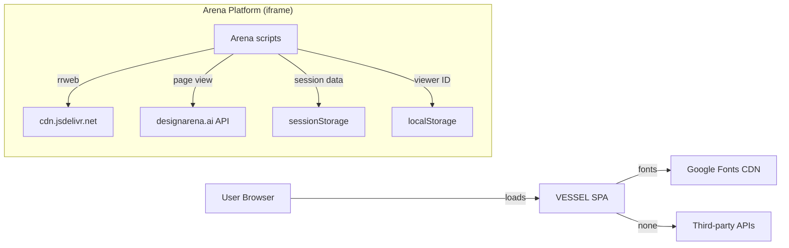

# Security

## Threat Model

VESSEL is a **static, client-only application** with no backend, no authentication, no user data storage, and no server communication. The attack surface is minimal.

## Client-Side Security

### No User Data

The application generates a random seed on each visit via `crypto.getRandomValues`. No user input is stored, transmitted, or persisted. There is no login, no form submission, no cookies, and no localStorage usage (beyond Arena platform scripts).

### No External API Calls

The VESSEL application itself makes zero network requests. All content is bundled or loaded from the same origin.

**Exception**: Google Fonts are loaded from `fonts.googleapis.com` / `fonts.gstatic.com` at page load. This leaks the user's IP address to Google. If this is a concern, fonts should be self-hosted.

### Arena Platform Scripts

The `index.html` embeds three scripts that are **not part of VESSEL**:

1. **Session recording** — Loads `rrweb` from `cdn.jsdelivr.net`, captures DOM mutations, clicks, scrolls, key presses, and mouse movements. Stores in `sessionStorage`. Reports to parent iframe via `postMessage`.

2. **Page-view tracking** — POSTs to `https://www.designarena.ai/api/agon/page-views` with viewport dimensions, referrer domain, and a generated viewer ID stored in `localStorage`.

3. **Element picker** — Enables DOM inspection and inline text editing via `postMessage` from the parent iframe.

**Security implications**:
- Third-party script loaded from CDN (`cdn.jsdelivr.net`) — supply chain risk
- Keydown events are captured (excluding INPUT/TEXTAREA) — records non-sensitive navigation keys
- `postMessage` with `'*'` origin — accepts messages from any origin, though the handlers only respond to recognized message types
- Viewer ID persisted in `localStorage` — cross-session tracking

These scripts are injected by the Arena platform and should be removed for standalone deployment.

### Dependency Risks

| Dependency | Risk | Notes |
|---|---|---|
| `react` / `react-dom` | Low | Facebook-maintained, widely audited |
| `framer-motion` | Low | Popular animation library |
| `lucide-react` | **Unused** | Can be removed |
| `react-router-dom` | **Unused** | Can be removed |
| `tailwindcss` | Low | Build-time only |
| `@babel/parser` (transitive) | Low | Used by source-tags plugin at build time |

### Unused Dependencies

`lucide-react` and `react-router-dom` are listed in `package.json` but are not imported anywhere in the source code. They add to the bundle size and dependency tree without contributing functionality. They should be removed.

### Content Security Policy

No CSP headers or meta tags are configured. For standalone deployment, consider:

```
Content-Security-Policy:
  default-src 'self';
  script-src 'self';
  style-src 'self' 'unsafe-inline' fonts.googleapis.com;
  font-src fonts.gstatic.com;
  img-src 'self' data:;
  media-src 'self';
  connect-src 'none';
```

This would block:
- The Arena platform scripts (desirable for standalone)
- The rrweb CDN script
- The page-view tracking POST

### Subresource Integrity

No SRI hashes are used for external resources (Google Fonts, rrweb CDN). For production deployment, SRI should be added to the Google Fonts `<link>` tags.

## Data Flow Security



The VESSEL application itself (the React app) is completely self-contained. All external communication comes from Arena platform scripts.

## XSS Considerations

- No user input is rendered as HTML
- All text content comes from `lib/lexicon.ts` constants
- Image `alt` and `src` attributes come from the static catalog
- `pointer.ts` data is used only in `textContent` assignments
- The spawn system uses `Math.random()` (not seeded) for text selection, but all selectable texts are from the hardcoded `FRAGMENTS` / `SHORT` arrays

**No XSS vectors identified in the VESSEL application.**

The Arena element picker uses `contenteditable` and modifies DOM content, but this is within the Arena platform's scope, not VESSEL's.
