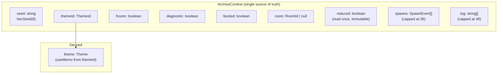

# State Model

## State Ownership

VESSEL centralizes nearly all state in `ArchiveContext`. The design favors simplicity over performance — every state change triggers a re-render of all 15+ context consumers.



### State Descriptions

| Field | Type | Mutable? | Initial Value | Lifecycle |
|---|---|---|---|---|
| `seed` | `string` | Yes (via `regenerate`) | `hexSeed(8)` | Persists across component mounts; changes trigger full regeneration |
| `themeId` | `ThemeId` | Yes (via `mutateTheme`) | `'vessel'` | Cycles through 7 values |
| `theme` | `Theme` | Derived | `themeById('vessel')` | Recomputed when `themeId` changes; applied to DOM via `useEffect` |
| `frozen` | `boolean` | Yes (via `toggleFreeze`) | `false` | When true, CSS animations pause, canvas rendering halts |
| `diagnostic` | `boolean` | Yes (via `toggleDiagnostic`) | `false` | Shows debug grid, pointer readout, and log tail |
| `booted` | `boolean` | Yes (via `setBooted`) | `false` | Once true, boot overlay is permanently removed |
| `room` | `RoomId \| null` | Yes (via `openRoom`/`closeOverlays`) | `null` | Controls hidden room overlay |
| `reduced` | `boolean` | **No** | `prefersReduced()` | Checked once at mount. **Does not update if user changes OS setting.** |
| `spawns` | `SpawnEvent[]` | Yes (via `spawnAt`) | `[]` | FIFO queue, capped at 36. Old entries silently dropped. |
| `log` | `string[]` | Yes (via `pushLog`) | 2 entries | FIFO queue, capped at 48. Old entries silently dropped. |

### Derived State

`theme` is derived from `themeId` via `useMemo`:
```typescript
const theme = useMemo(() => themeById(themeId), [themeId]);
```

All other state is independently mutable.

## Module-Level Mutable State

### `lib/pointer.ts`

```typescript
export const pointer = { x: 0, y: 0, vx: 0, vy: 0 };
export const scroll = { y: 0 };
```

This is a **module-level mutable singleton** — not React state, not in a ref, just plain JavaScript objects mutated in place. It exists as a performance optimization: pointer data updates at 60fps and would cause excessive re-renders if routed through Context.

**Writers**: `CustomCursor` (pointer), `InfiniteArchive` (scroll)
**Readers**: `HUD` (polls every 140ms), `Diagnostic` (polls every 80ms)

**Risk**: If two components read the same field at different times within one frame, they could see inconsistent values. In practice this is imperceptible since the data is display-only.

## Local Component State

### `FloatingWindows`

| State | Type | Purpose |
|---|---|---|
| `wins` | `WinSpec[]` | Current window positions (updated on drag) |
| `closed` | `Record<string, boolean>` | Which windows have been closed |
| `zTop` | `Ref<number>` | Monotonically increasing z-index counter |

### `InfiniteArchive`

| State/Ref | Type | Purpose |
|---|---|---|
| `range` | `{ lo: number, hi: number }` | Visible cluster index range |
| `heights` | `Ref<Map<number, number>>` | Cached cluster heights |
| `root` | `Ref<HTMLDivElement>` | Root element ref |

### `LivingImage`

| State | Type | Purpose |
|---|---|---|
| `hover` | `boolean` | Mouse hover state |
| `split` | `boolean` | Split behavior active (set on hover for `behavior: 'split'`) |

### `BootSequence`

| State | Type | Purpose |
|---|---|---|
| `n` | `number` | Number of lines revealed so far |

## Invariants

1. **Seed determinism**: `generateCluster(seed, index)` must return identical output for identical inputs across all calls. This is guaranteed by mulberry32 being a pure function of its seed.

2. **Spawn cap**: `spawns.length <= 36`. When exceeded, the oldest entries are dropped.

3. **Log cap**: `log.length <= 48`. When exceeded, the oldest entries are dropped.

4. **Boot monotonicity**: `booted` can only transition `false → true`, never back.

5. **Room exclusivity**: `room` is either `null` or a single `RoomId`. Multiple rooms cannot be open simultaneously. `closeOverlays` sets both `room = null` and `diagnostic = false`.

6. **Theme cycling**: `nextThemeId` is a deterministic rotation through the 7-element `THEMES` array.

7. **Freeze cascade**: When `frozen === true`:
   - All CSS animations pause (`.frozen * { animation-play-state: paused !important }`)
   - `OverlayFX` canvas stops rendering
   - `CustomCursor` canvas stops rendering
   - `OverlayFX` video grain continues playing (video element is not paused programmatically)

## Side Effects

### In ArchiveContext

| Method | Side Effects |
|---|---|
| `mutateTheme()` | Writes to `document.documentElement.style` via `applyTheme` |
| `regenerate()` | Resets scroll position (indirectly, via `InfiniteArchive` useEffect) |
| `pushLog()` | None beyond state update |

### In Components

| Component | Side Effects |
|---|---|
| `CustomCursor` | Writes to `pointer.ts` singleton; modifies `document.body.style.cursor` (hides native cursor) |
| `InfiniteArchive` | Writes to `pointer.ts` singleton; calls `window.scrollTo(0, 0)` on seed change |
| `OverlayFX` | Writes to canvas pixel data |
| `BootSequence` | Calls `setBooted` after timeout |

### In Library Modules

| Module | Side Effects |
|---|---|
| `themes.ts` → `applyTheme()` | Writes 10 CSS custom properties to `document.documentElement.style` and sets `data-theme` attribute |
| `rng.ts` → `hexSeed()` | Reads from `crypto.getRandomValues` (not deterministic) |

## State Transitions

```mermaid
stateDiagram-v2
    [*] --> Booting: mount
    Booting --> Running: setBooted(true)

    state Running {
        [*] --> Normal
        Normal --> Frozen: toggleFreeze()
        Frozen --> Normal: toggleFreeze()
        Normal --> Diagnostic: toggleDiagnostic()
        Diagnostic --> Normal: toggleDiagnostic()
        Normal --> Room: openRoom(id)
        Room --> Normal: closeOverlays()
    }

    Running --> Regenerated: regenerate()
    Regenerated --> Running: same state, new seed

    Running --> ThemeChanged: mutateTheme()
    ThemeChanged --> Running: same state, new themeId
```



## Immutability Patterns

- `ClusterSpec` and all generation output types are plain objects with no prototype methods — they are effectively immutable once created but not frozen
- `CATALOG`, `FRAGMENTS`, `WARNINGS`, `SHORT`, `THEMES`, and other `lib/` exports are module-level constants (effectively immutable)
- `SpawnEvent` objects are created once and never mutated
- `log` and `spawns` arrays are spread-copied on update (`[...prev, item]`)
- No `useReducer` is used anywhere; all state updates go through `useState` setters
